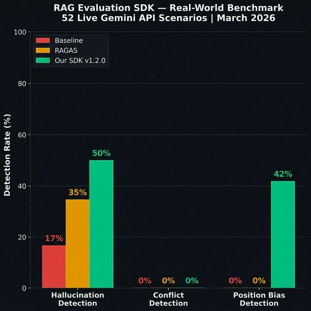

# 🔍 RAG Evaluation SDK

**A diagnostic evaluation toolkit for RAG pipelines that catches failure modes RAGAS and other tools miss.**

[](https://www.python.org/downloads/)
[](LICENSE)
[](https://ai.google.dev/)

> **TL;DR:** We detect 44% more hallucinations than RAGAS by combining embedding metrics with position bias detection, phantom chunk analysis, and failure mode classification — signals that existing tools are architecturally blind to.

---

## 📊 Benchmark Results (52 Real-World Scenarios)

Tested on **live Gemini 2.5 Flash API responses** — not synthetic data.

| Metric | Baseline | RAGAS | **Our SDK** |
|---|---|---|---|
| Hallucinations flagged | 9/52 (17%) | 18/52 (35%) | **26/52 (50%)** ✅ |
| Position bias detected | 0/52 | 0/52 | **22/52 (42%)** 🔥 |
| Failure mode diagnosis | ❌ | ❌ | ✅ |
| Chunk attribution map | ❌ | ❌ | ✅ |

<p align="center">
  
</p>

---

## 🚀 What Makes This Different?

Standard tools give you a **score**. We give you a **diagnosis**.

```
❌ RAGAS says:    "Faithfulness: 0.72"
✅ Our SDK says:  "Faithfulness: 0.72 — LLM ignored chunks 4-6 due to 
                   position bias (U-shaped). 3 phantom chunks wasted.
                   Failure mode: POSITION_BIAS. Fix: reorder chunks."
```

### 6 Features (4 are Novel)

| # | Feature | Novel? | What it does |
|---|---------|--------|--------------|
| 1 | Relevance & Hallucination Scoring | — | Embedding-based faithfulness metrics |
| 2 | **Chunk Attribution Map** | ✅ | Which chunks the LLM used vs ignored ("phantom chunks") |
| 3 | **Inter-Chunk Conflict Detector** | ✅ | Finds contradictions in retrieved context *before* generation |
| 4 | **Position Bias Detector** | ✅ | Detects "Lost in the Middle" — LLM ignoring middle chunks |
| 5 | **Failure Mode Classifier** | ✅ | Root-cause diagnosis: retriever vs generator fault |
| 6 | LLM-as-Judge | — | Gemini cross-validates faithfulness at sentence level |

---

## ⚡ Quick Start

### 1. Install

```bash
pip install -e .
```

### 2. Set up API key

Get a free key from [aistudio.google.com](https://aistudio.google.com)

```bash
cp .env.example .env
# Edit .env and add your GEMINI_API_KEY
```

### 3. Run evaluation

```python
from rag_eval_sdk import (
    score_relevance_completeness,
    score_hallucination,
    score_attribution_map,
    detect_conflicts,
    detect_position_bias,
    classify_failure_mode,
    judge_faithfulness,
)

chunks = [
    {"id": 1, "text": "The clinic is open Monday through Friday."},
    {"id": 2, "text": "We are closed on weekends and holidays."},
]
response = "The clinic is open Mon-Fri and closed on weekends."
retriever_scores = [0.91, 0.85]

# Core metrics
relevance = score_relevance_completeness(response, chunks)
hallucination = score_hallucination(response, chunks)

# Novel features
attribution = score_attribution_map(response, chunks)
conflicts = detect_conflicts(chunks)
bias = detect_position_bias(response, chunks, retriever_scores)

print(f"Relevance: {relevance}")
print(f"Hallucination: {hallucination}")
print(f"Phantom chunks: {attribution['phantom_count']}")
print(f"Conflicts: {conflicts['conflict_count']}")
print(f"Position bias: {bias['bias_detected']}")
```

### 4. Run the benchmark

```bash
python benchmarks/real_world_test.py
```

---

## 📁 Project Structure

```
rag-eval-sdk/
├── rag_eval_sdk/                  # The pip-installable SDK
│   ├── evaluators.py              # Relevance & hallucination scoring
│   ├── chunk_attributor.py        # [NOVEL] Chunk attribution map
│   ├── conflict_detector.py       # [NOVEL] Inter-chunk conflict detection
│   ├── position_bias_detector.py  # [NOVEL] Position bias detection
│   ├── failure_classifier.py      # [NOVEL] Failure mode classification
│   ├── llm_judge.py               # LLM-as-Judge (Gemini)
│   ├── llm.py                     # Gemini API wrapper
│   ├── embeddings.py              # Sentence-transformer embeddings
│   └── main.py                    # Full pipeline orchestrator
│
├── benchmarks/
│   ├── real_world_test.py         # 52-scenario live benchmark
│   ├── run_benchmarks.py          # Synthetic benchmark (20 scenarios)
│   └── results/                   # Benchmark outputs & comparison charts
│
├── src/                           # Original pipeline (pre-SDK)
├── data/                          # Sample context chunks & queries
├── tests/                         # Unit tests
├── docs/
│   ├── SDK_GUIDE.txt              # Developer integration guide
│   ├── LLM_AND_RAG_FUNDAMENTALS.txt  # Concepts & background
│   └── MARKET_POSITIONING_2026.txt   # Market analysis
│
├── pyproject.toml                 # Package configuration
├── requirements.txt
└── README.md
```

---

## 🧪 How the Benchmark Works

All three methods evaluate the **same** Gemini response for fair comparison:

```
User Query → Gemini 2.5 Flash → Response
                                    ↓
                    ┌───────────────┼───────────────┐
                    ↓               ↓               ↓
                Baseline        RAGAS-style      Full SDK
              (cosine sim)   (per-sentence)  (6 features)
                    ↓               ↓               ↓
              9/52 flagged    18/52 flagged    26/52 flagged
```

52 scenarios across 5 categories:
- **Faithful** (10) — clean grounding, should pass
- **Hallucination-prone** (10) — sparse context, likely to fabricate
- **Conflicting context** (12) — contradictory chunks
- **Position bias** (10) — good middle chunks likely ignored
- **Mixed failure** (10) — multiple issues combined

---

## 📜 Key Research

This project builds on:

- **"Lost in the Middle"** (Liu et al., NeurIPS 2023) — LLMs ignore middle context chunks
- **"RAGAS"** (Es et al., 2023) — Baseline we benchmark against
- **"Judging LLM-as-a-Judge"** (Zheng et al., 2023) — LLMs evaluating LLMs
- **"FActScore"** (Min et al., 2023) — Sentence-level factuality evaluation

---

## 🛠 Tech Stack

| Component | Technology |
|-----------|-----------|
| LLM | Google Gemini 2.5 Flash |
| Embeddings | all-MiniLM-L6-v2 (sentence-transformers) |
| Language | Python 3.9+ |
| Package | pip-installable (pyproject.toml) |

---

## 📄 License

MIT License — free to use, modify, and distribute.

---

<p align="center">
  <b>Built to make RAG pipelines trustworthy.</b>
</p>
